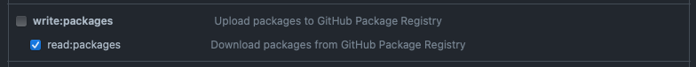

# Open Industry 4.0 Alliance - Open Edge Computing Service
The oi4-service repository contains all artifacts to build a service compliant to [OEC Development Guideline v1.0.0](docs/OI4_OEC_Development_Guideline_V1.0.0.pdf).
It also covers a base service that will help you build your own compliant OI4 OEC service by providing most of the OI4 state machine.

JSON schemas and models will help you to process, validate and publish OI4 OEC compliant messages.

The oi4-service is a community project and is not offered by the OI4 Alliance. It is published under the MIT license
AND most important it is an OI4 open source project that needs your contribution!
If you want to contribute and do not know how, just reach out for the WG leads.

## Installation

### Setup the environment
The `oi4-oec-service` is a TypesScript application. To get started you need a proper NodeJS and Yarn installation.
Please install [nodejs](https://nodejs.org/en) and [yarn](https://classic.yarnpkg.com/lang/en/docs/install/).

### GitHub package repository access
Dependencies to the oi4-service are available in the GitHub package repository. As the OI4 repositories are private, you need to authenticate to the GitHub repository using a [personal access token](https://docs.github.com/en/authentication/keeping-your-account-and-data-secure/creating-a-personal-access-token) (PAT).
The PAT must have the 'read:packages'.


The installation and build scripts will use the preconfigured .npmrc file to access the GitHub package repository. The PAT must be stored in the .env file in the project root with the key `PACKAGES_AUTH_TOKEN`. As the .env file is not always applied when using the console, the PAT should also be set as an environment variable.
The bash script `setenv.sh` will process the .env file and set the PAT as an environment variable. On Linux based systems just run `source ./scripts/setenv.sh`.


To install locally run

```sh
yarn install
yarn bootstrap
yarn build
```
